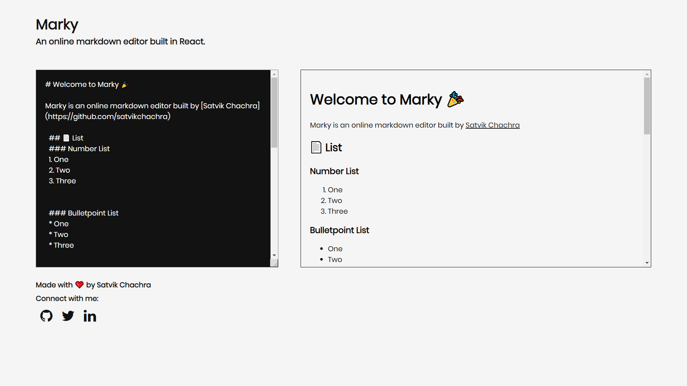

# Marky

* Marky is a markdown editor built in React that works on desktop & mobile browser.
* The aim of this app is to help you preview your markdowns.

### View Live Demo
<pre><a href="https://markdown-previewer.satvikchachra.vercel.app/"><b>markdown-previewer.satvikchachra.vercel.app</b></a></pre>

### Images
<details>
  <summary>Landing Page</summary>
  
</details>

## Features
* Realtime preview of markdowns

## Setup
#### Clone this repository
```bash
https://github.com/satvikchachra/markdown-previewer.git
```

#### Move to desired directory
```bash
cd markdown-previewer
```
#### To install the dependencies
```bash
npm install
```
#### To run the app
```bash
npm start
```

## Learn More

You can learn more in the [Create React App documentation](https://facebook.github.io/create-react-app/docs/getting-started).
<br>
To learn React, check out the [React documentation](https://reactjs.org/).


##### Made with ♥ by <a href="https://github.com/satvikchachra">satvikchachra</a>

[](https://github.com/satvikchachra)

